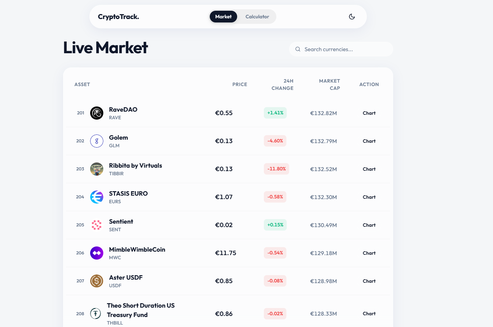
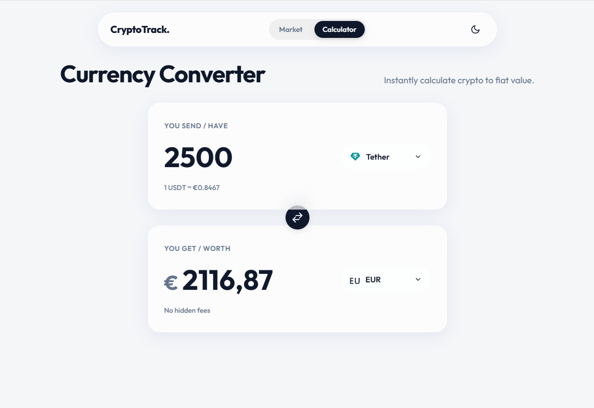

<a name="top"></a>

<div align="center">

# ₿ CryptoTrack

### Premium Real-Time Cryptocurrency Tracker & Calculator

[](https://your-username.github.io/crypto-tracker)
[](LICENSE)
[](https://developer.mozilla.org/en-US/docs/Web/HTML)
[](https://developer.mozilla.org/en-US/docs/Web/CSS)
[](https://developer.mozilla.org/en-US/docs/Web/JavaScript)

A polished, minimalist Single Page Application for tracking live crypto prices, converting currencies, and viewing interactive TradingView charts — all without a backend or any API key.

</div>

---

## Screenshots

<table>
  <tr>
    <td width="50%">
      
      <p align="center"><b>Live Market View</b></p>
    </td>
    <td width="50%">
      
      <p align="center"><b>Currency Converter</b></p>
    </td>
  </tr>
</table>

---

## Features

- **250 Live Coins** — Top 250 cryptocurrencies by market cap, updated via [CoinGecko API](https://www.coingecko.com/en/api)
- **Paginated Market Table** — 50 coins per page with smooth navigation
- **Real-Time Search** — Instant filter across names and symbols
- **Interactive TradingView Charts** — Full candlestick charts via modal on any coin
- **Bidirectional Currency Calculator** — Type in crypto **or** fiat, instant conversion both ways
- **7 Fiat Currencies** — USD, EUR, RUB, BYN, GBP, KZT, UAH with live exchange rates
- **Searchable Coin Selector** — Custom dropdown with coin icons and live search
- **Light / Dark Theme** — Saved to localStorage, respects system preference
- **SPA Architecture** — Instant view transitions, no page reloads
- **Zero Dependencies** — Pure HTML, CSS, and Vanilla JS. No frameworks, no bundlers

---

## Tech Stack

| Layer | Technology |
|---|---|
| Markup | HTML5 |
| Styling | CSS3 — Glassmorphism, `backdrop-filter`, CSS Variables |
| Logic | Vanilla JavaScript (ES2020+) |
| Fonts | [Outfit](https://fonts.google.com/specimen/Outfit) via Google Fonts |
| Market Data | [CoinGecko Public API](https://docs.coingecko.com/) |
| Fiat Rates | [ExchangeRate API](https://www.exchangerate-api.com/) |
| Charts | [TradingView Widget](https://www.tradingview.com/widget/) |

---

## Getting Started

No installation required. Just open `index.html` in any modern browser.

```bash
git clone https://github.com/your-username/crypto-tracker.git
cd crypto-tracker
# Open index.html in your browser
open index.html
```

Or serve with any static server:

```bash
npx serve .
```

---

## Project Structure

```
crypto-tracker/
├── index.html          # App shell & SPA views
├── css/
│   └── style.css       # Glassmorphism design system
└── js/
    └── app.js          # All application logic
```

---

## API Usage

This project uses **public, keyless APIs** only:

| API | Endpoint | Used for |
|---|---|---|
| CoinGecko | `/api/v3/coins/markets` | Live prices, market caps, coin icons |
| ExchangeRate-API | `/v4/latest/USD` | Fiat conversion rates |
| TradingView | Widget CDN | Interactive candlestick charts |

> CoinGecko public API has a rate limit of **~30 req/min**. Refresh sparingly.

---

## License

MIT © 2026
